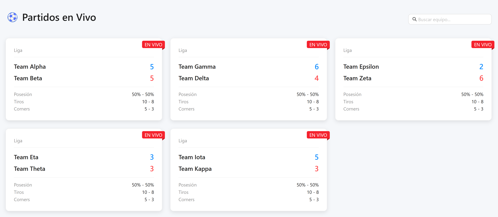
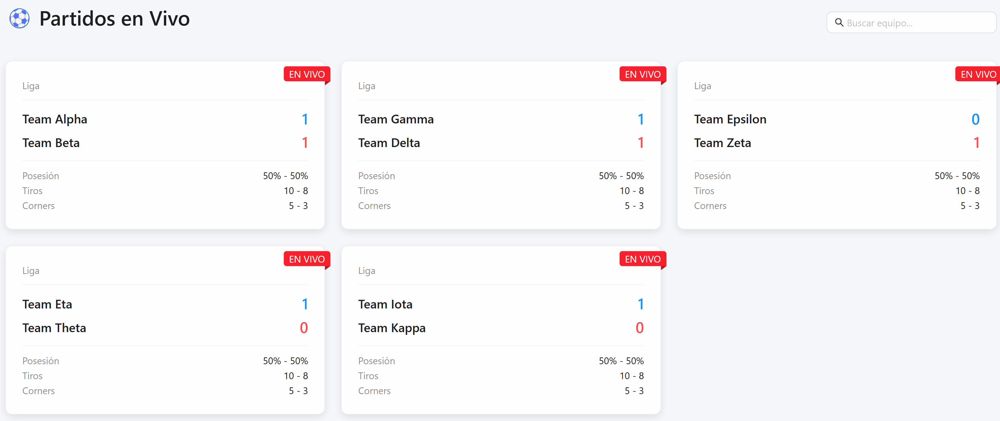

# ⚽ Live Match Tracker (React, Redux & Socket.IO)

A web application built with **React** and **Redux Toolkit**, providing real-time updates of live matches using **WebSockets (Socket.IO)**. It features instant score updates, statistics, and an intuitive, responsive interface designed with **Ant Design**.

---

## ✨ Project Overview

This project showcases efficient state management with Redux Toolkit combined seamlessly with real-time updates via WebSockets, ensuring a smooth and engaging user experience.

---

## 🚀 Key Features:

- 📡 **Real-Time Match Updates:** Instantly update match scores via WebSockets.
- 🔄 **Redux State Management:** Optimized state handling with Redux Toolkit.
- 🎨 **Clean UI:** Professional and modern interface created with Ant Design.
- 📊 **Match Statistics:** Real-time statistics for possession, shots, and corners.

---

## ⚙️ Installation & Setup

### Clone Repository

```bash
git clone https://github.com/kailucho/live-match-tracker-react
cd live-match-tracker-react
```

### Frontend Setup
```bash
cd frontend
npm install
npm start
```

### Backend Setup
```bash
cd backend
npm install
npm start
```

---

## 🌐 Live Demo
[(Add your deployed project URL if available)](https://live-match-tracker-react.vercel.app/)

---

## 📷 Screenshots



---

## 🎥 GIF Demonstration



---

## 🛠️ Technology Stack

### **Frontend**
- React
- Redux Toolkit
- Ant Design
- socket.io-client

### Backend
- Node.js
- Express
- Socket.IO

---

## ✨ Lessons Learned
- Real-time state management and optimization with Redux and WebSockets.
- Designing professional user interfaces with Ant Design.
- Integrating frontend and backend seamlessly using Socket.IO.

---

## 👤 Author
Luijhy | [GitHub](https://github.com/kailucho)

---
